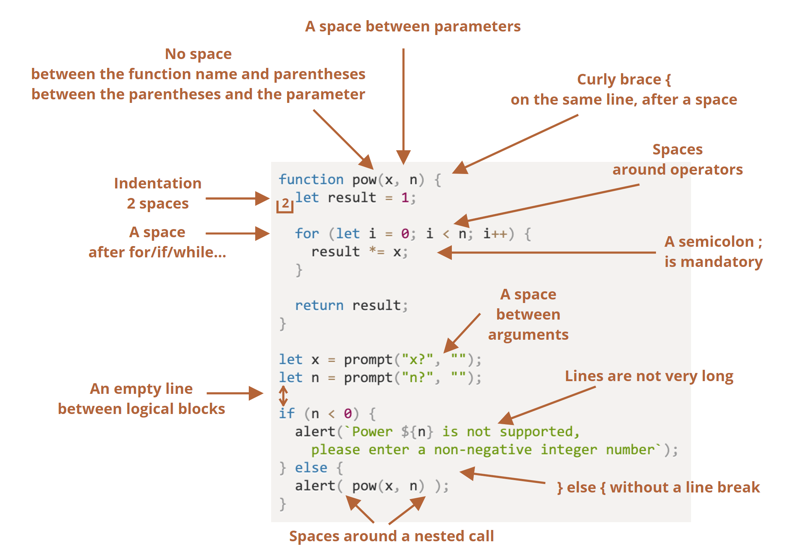

<h2>Standards Actually Make Coding Less Intimidating</h2>

  Let’s all be honest here.  Programming can be incredibly difficult and intimidating, especially when one is first getting started on trying to learn it.  One thing that can make programming even more difficult, however, is if the programmer does not adhere to any proper coding standards.  Code with no indents, non-descriptive and generic variable names, no blank lines for readability, and to top it off, no comments to explain what on earth is going on could be an absolute nightmare to try and read.  Not adhering to coding standards in the beginning with only a few lines of code may not be too hard to decipher, but when it’s hundreds of lines of code, it will be incredibly tedious for you and especially other programmers to work through.  This is why it is so important to always be aware and to try one’s best to follow coding standards.

 

   One example of how a standard can make coding more readable is the convention that functions should be declared before they are to be used. This helps make the person reviewing the code aware of the functions being used and how they work before they see them being used. 
 

 

 One example of how disastrous it can be when one does not follow coding standards is how Pokemon was almost doomed because the programmers at GameFreak had extremely messy and borderline unreadable code in their first Pokemon game. Today, everyone knows Pokemon; it’s literally the number one most successful media franchise in the entire world last time I checked, beating even Star Wars, Super Mario, and the Marvel Cinematic Universe.  As a fan of video games, I have done some digging in my spare time on the history of some of the most popular gaming franchises, including Pokemon.  The story goes that before Pokemon was all that popular, the small crew of Pokemon developers at GameFreak were <i>freaking</i> out (get it?) because Nintendo tasked them with making a sequel to their first two Pokemon games, Pokemon Red and Green.  The problem was, however, that Nintendo could barely help them out at all because nobody at Nintendo could read the messy code that the GameFreak employees wrote for Pokemon!  This caused the sequels to be delayed as there was such a limited amount of people who could work on the new games because only the original people who worked on the first Pokemon game could understand the code and use it to make the sequel.  Back then, Pokemon was not profitable enough to almost guarantee success like it is today, so delaying the sequels could have had some major consequences if it was delayed too long; the spark of interest in the new gaming franchise could eventually die down, and the sequels could be a financial failure.  It wasn’t until Satoru Iwata, who would later become Nintendo’s president, went to work deciphering the messy code and fixing it that Pokemon was saved, the sequels were released without too much delay, and Pokemon eventually became the gaming giant it is today.   Thank you

 

<h2>My Experience with ESLint</h2>

 I have been working with ESLint, a tool to help one conform to coding standards, for around a week now in my Javascript journey.  So far, while it can be mildly annoying to go back and fix things that are not technically errors just to conform to standards, I know that in the long run, this is helping me have practice coding readable code.  I also appreciate how the feedback is immediate.  Overall, my impressions of ESLint are mostly positive, and I am glad to have been introduced to such a helpful coding standards tool early on in my career.   

