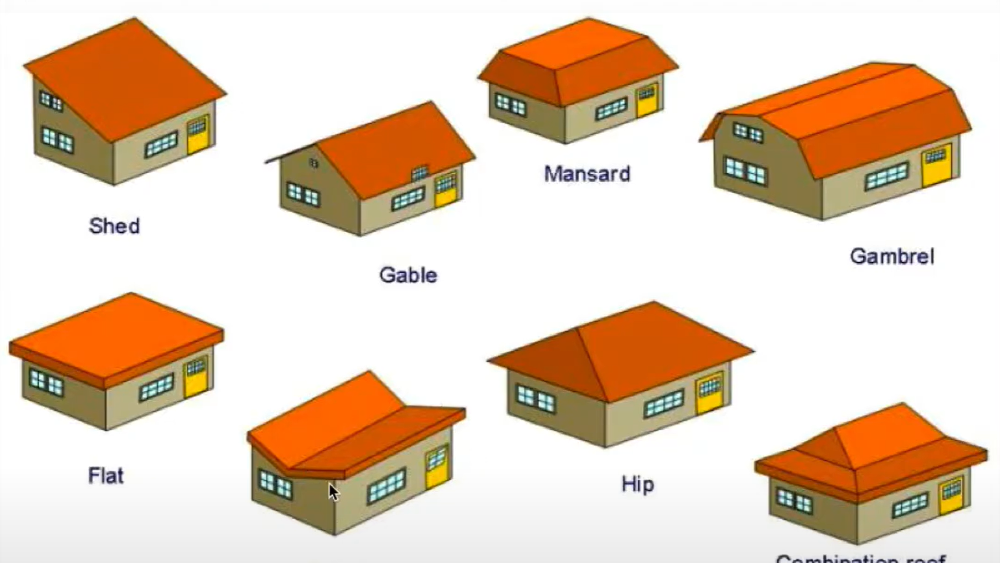

 <h2> Design is Important </h2>

 

 
 
  When one thinks of design, they may jump to the idea of fashion and how to make a particular design of fabric appealing to consumers.  While fashion is definitely important in its own way, design is used for so much more than just that.  Throughout human history, design patterns have been crucial to our advancement as a society.  Design patterns have made life more convenient for us, and allowed us to build off previous design patterns and ideas.  One of the biggest examples of this is the literal invention of the wheel itself in ancient Sumer.  Why is the wheel designed to be round?  It is because round wheels are the best and most useful shape to use on barrels and vehicles to transport objects and people.  Building off the design of the wheel, we’ve created barrels, chariots, bicycles, and eventually cars.  Another example of an important design pattern (though not as prominent as the wheel) is rooftop designs (shown above).  As one of my university professors pointed out, the “butterfly” roof (between the “hip” and the “flat” roof in the image above) would not be so great for places known to have snowy weather as snow could easily pile up on the roof and be hard to scrape off. 
 
 
Software engineering is no different.	Now as we move into the technological age, we have once again come up with design patterns for coding as well for the same basic purposes: to make our lives easier and to not have to start ideas from scratch every time.  In 1994, the “Gang of Four”, inspired by Christopher Alexander’s 1977 book, <i>A Pattern Language</i>, wrote one of the most cited and highly esteemed computer science books of all time, <i>Design Patterns</i>.  In it, they discussed design patterns in C++.  While some of their low level ideas may be somewhat outdated, the high level ideas presented in this book are still very applicable and widely used today.  Some computer design patterns include the factory design (this can return concrete instances of the generic class like how a Shape class might return a square or rectangle instance), a singleton design (only one instance of the class can exist which is easy to implement), the observer design (set of objects play the observer and are informed when a change of state occurs to another object), and (perhaps the most important of them all), the MVC design (separates the model database from the view presentation and have a controller mediate between the two).
 

## My Experience With Design
 
As for me, I am relatively new to learning software development, so I have only just begun learning about and attempting to use these patterns.  
Right now, I am working on a group project to create a website that involves Meteor, React, Bootstrap, HTML, CSS, and Javascript.  Through learning how to work with both front end and back end, I have had a bit of experience with trying some of these design patterns myself.  For example,  I was working with Mongo databases, each of which is within its own Javascript class. Every time I worked on Javascript files, either I or my group members had to make sure that we exported a constant instance of it to the rest of the database. This was us using a singleton design pattern. 
 
 
So far, this experience of working within a group has given me useful experiences not only with team bonding, collaboration, and coding in general, but of course with design patterns as well.  I am new to design patterns, but am excited to learn and experience even more of using these types of patterns in the future.
