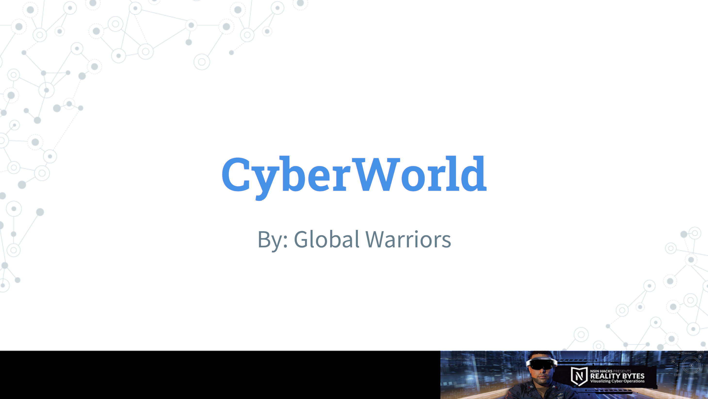
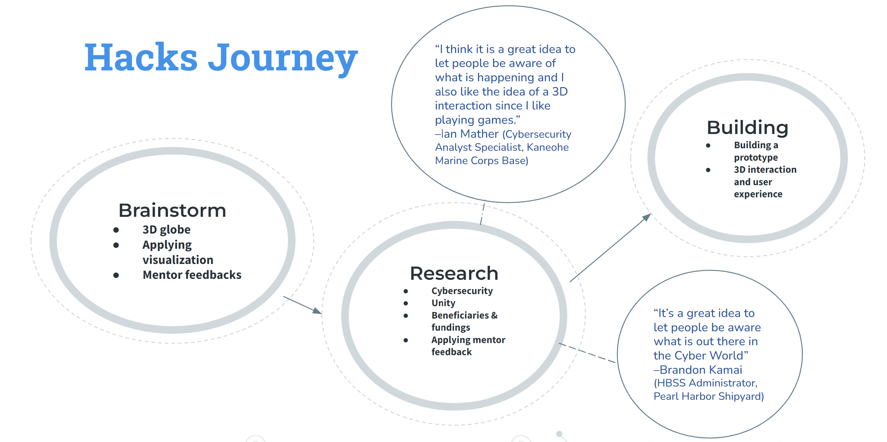

  

 
 

I and a small group of other students participated in the 2022 Reality Bytes Hackathon where we came up with possible solutions to better visualize and monitor cybersecurity events. Our proposal was a 3D interactive map called “CyberWorld”, that would feature
cyberthreats, the type of attack, and its severity for all countries across the globe. We also
proposed it would be implemented via Unity because Unity features convenient applications that
can be used across various platforms like iOS, Windows, Android, and more.
One of the challenges for this hackathon was to gamify the data. CyberWorld’s
navigation would feature a character that “walks” around the globe to view the data to make it
more engaging and interactive.
 
We ended up becoming finalists in the student track of the hackathon and presented our
solution via slides to a panel of judges. While we didn’t win, it was still a great experience for
me and my group to critically think about ways to solve a real world problem.
 

 

 

You can learn more about the Hackathon at [Reality Bytes Introduction Video](https://www.youtube.com/watch?v=z-tYzpRxfQQ) and the Reality Bytes Hackathon information page on the [UNUM](https://unum.nsin.us/reality-bytes) website (note: you may need an account on UNUM to view it).
