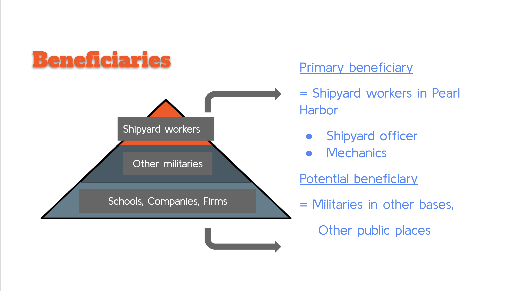
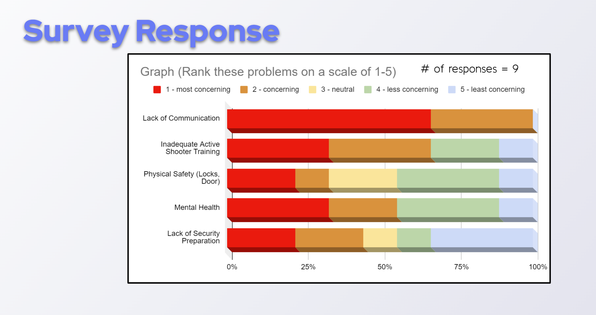

The mouse will need to keep track of where it is, discover walls as it explores, map out the maze and detect when it has reached the center.  having reached the center, the mouse will typically perform additional searches of the maze until it has found the most optimal route from the start to the center.  Once the most optimal route has been determined, the mouse will run that route in the shortest possible time.

 

Our project was showcased on the [UNUM](https://unum.nsin.us/uofh/customObject/viewCustomObject/5aaeffbce6a8) website (you have to have an account to view it).
